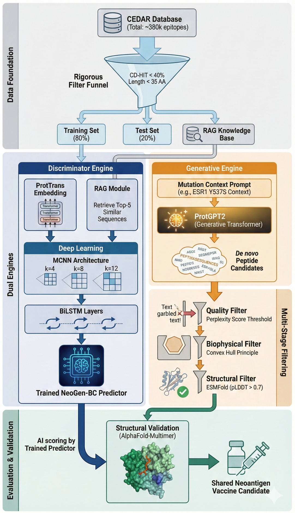

# NeoGen-BC: Overcoming the Immune-Cold Barrier in HR+ Breast Cancer via AI-Designed MHC-II Restricted Neoantigens
Van The Le, Juan Peter Timothy Yuune, Jiun-I Lai, Yu-Yen Ou
|[ 🎇&nbsp;Abstract](#abstract) |[📃&nbsp;Dataset](#Dataset) | [ 🚀&nbsp;Quick Prediction ](#colab) |[ 💾&nbsp;Requirements](#requirement)|
|-------------------------------|-----------------------------|------------------------------------- |--------------------------------------|

## 🎇Abstract <a name="abstract"></a>
Background: Hormone receptor-positive (HR⁺) breast cancer, traditionally classified as an immunologically "cold" tumor, presents a major challenge for immunotherapy. Research using novel drugs aiming to upregulate IFN-γ and MHC-II expression are under intense development with the goal of enhancing immunogenicity. However, discovering effective targets remains difficult: current methods rely heavily on peptide-HLA binding affinity (e.g., NetMHCIIpan), often failing to identify immunogenic shared neoantigens derived from recurrent driver mutations like ESR1 and PIK3CA, which are critical for eliciting CD4⁺ T cell responses.
<br>
Methods: To overcome the limitations of passive screening, we introduce NeoGen-BC, a synergistic framework that shifts the paradigm from discrimination to generative design. NeoGen-BC integrates protein language model (PLM) embeddings with a multi-scale MCNN-BiLSTM classifier to capture latent immunogenic features beyond simple binding affinity. Crucially, a generative ProtGPT2 module is deployed to actively design de novo peptide candidates based on driver mutation contexts, which are then rigorously filtered via retrieval-augmented learning (RAG), biophysical profiling, and structural validation using AlphaFold-Multimer.
<br>
Results: In a direct head-to-head comparison, NeoGen-BC significantly outperformed NetMHCIIpan 4.3 in identifying experimentally validated MHC-II–restricted shared neoantigens from ESR1 (Y537S, D538G) and PIK3CA (H1047R). While conventional tools frequently classified these potent epitopes as non-binders (Rank > 10%), NeoGen-BC accurately predicted their immunogenicity. Furthermore, de novo peptides generated by our framework exhibited high structural stability in AlphaFold simulations, confirming their ability to form stable complexes with HLA-II molecules despite being novel sequences.
<br>
Significance: NeoGen-BC establishes a computational foundation for the rational design of "off-the-shelf" breast cancer vaccines. By prioritizing intrinsic immunogenicity over binding affinity and enabling the generative design of shared neoantigens, this framework offers a scalable precision strategy to maximize the efficacy for immunotherapy in HR⁺ breast cancer.
<br>



## 📃Dataset <a name="Dataset"></a>

| dataset            | epitopes |    Similarity < 0.4 |  Length < 35    |
|--------------------|------------------|--------------------------|--------------------------|
| Neoantigens      |   6516             |          561            |558                     |
| Others  |          377990  |                     2823   |                 2555     |

| dataset            | Training data (80%) |    Independent Test (20%) |
|--------------------|------------------|--------------------------|
| Neoantigens      |   446             |          112            |
| Others  |          2044  |                     511   |


## Discriminator <a name="colab"></a>

### Step 1: Environment Setup
Use pip install -r requirements.txt for environment dependencies

### Step 2: Prepare RAG database
Use get_prottrans_emb.py tool to generate embeddings for your RAG epitope database. The sequences for RAG are stored in rag_db.

### Step 3: Prepare FASTA sequences

Prepare your own FASTA file
The format of the FASTA file will be as follows:
```bash
>neopep_2233775
IQETIVPKEPPPQFEFIADPPSISA
>neopep_2233803
PIRTPSRSMPPLNQPSCKALYDFEP
>neopep_2233843
WSSQMRDNIIISVSTDRTLKVWNAE
>otherpep_236828
DPKRTIAQDYGVLKADEG
>otherpep_483964
RESQDTSFTTL
>otherpep_511355
AMGIMNSFVNDIFER
>otherpep_591956
DDVPHIALDGKLGGLVQPH
>otherpep_770175
AHESVVKSEDFSLPAYMDRRD
```

### Step 4: Generate Prottrans embedding
Use get_prottrans_emb.py for your sequences' embedding generation.

### Step 5: Get the RAG-KG ESM2 embedding
Use get_RagEmb_Batch_N.py tool for merging your sequences' ProtTrans embeddings with RAG database in the previous step 2.

### Step 6: Get the dataset for MCNN-BiLSTM
Use get_ds.py to generate input feature requirement for our model (Batch, 1, 35, 1024).

### Step 7: Prediction
We provided MCNN_BiLSTM notebook for one click prediction.

## Generator <a name="colab"></a>
Our checking of generative sequences from ProtGPT2 is illustrated in Checking_generated_sequences notebook. Analytic results are shown in good_generation folder.

## 📚&nbsp;License <a name="License"></a>
Licensed under the Academic Free License version 3.0
